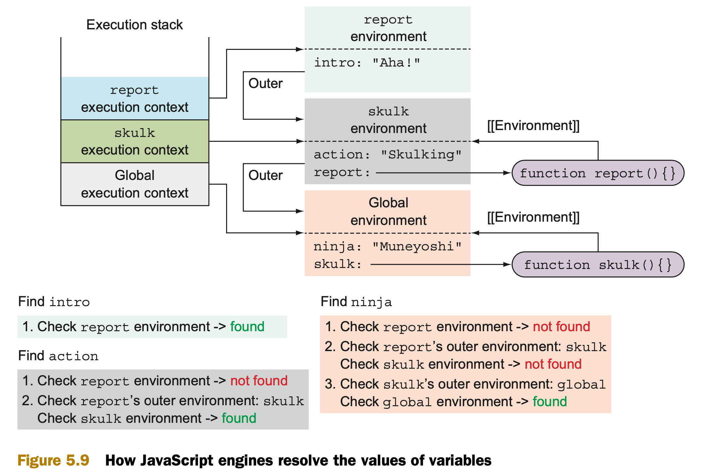
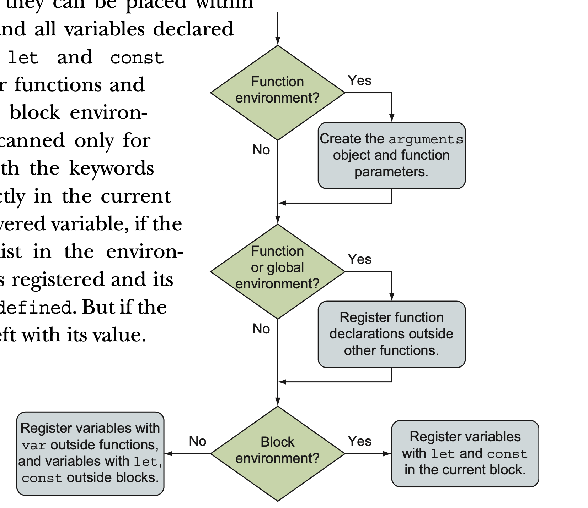
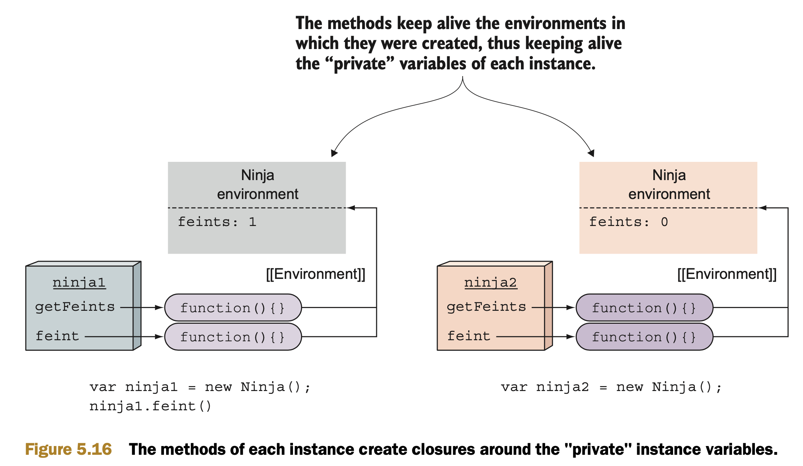

# Functions for the master: closures and scopes
* closures reduce the amount and complexity of code needed to add advanced features, but also enable us to do things that otherwise wouldn’t be possible, or would be too complex to be feasible.

## 5.1 Understanding closures
* A closure allows a function **to access and manipulate variables that are external** to that function.
* Closures allow a function to access all the variables, as well as other func- tions, that are in scope when the function itself is defined.
```
// Listing 5.1 A simple closure
var outerValue = "ninja";
function outerFunction(){
  assert(outerValue === "ninja","I can see the ninja.");
}
outerFunction();
```

```
// Listing 5.2 Another closure example
var outerValue = "samurai";
var later;
function outerFunction(){
  var innerValue = "ninja";
  
  function innerFunction(){
    assert(outerValue === "samurai", "I can see the samurai.");
    assert(innerValue === "ninja", "I can see the ninja.")
  }
  later = innerFunction; // Stores a reference to innerFunction in the later variable.
}

outerFunction();
later();
```
* When we declare innerFunction inside the outer function, not only is the function declaration defined, but a closure is created that encompasses the function definition as well as all variables in scope at the point of function definition. 
* When innerFunction eventually executes, even if it’s executed after the scope in which it was declared goes away, it has access to the original scope in which it was declared through its closure
* Closures create a “safety bubble” of the function and the variables in scope _at the point of the function’s definition_, so that the function has all it needs to execute.
* Although all this structure isn’t readily visible (there’s no “closure” object holding all of this information that you can inspect), storing and refer- encing information in this way has a direct cost.
* All that information needs to be held in memory until it’s absolutely clear to the JavaScript engine that it’s no longer needed (and is safe to garbage-collect), or until the page unloads.

## 5.2 Putting closures to work
#### 5.2.1 Mimicking private variables
* JavaScript **doesn’t have native support for private variables**. But by using a closure, we can achieve an acceptable approximation
  * There're only [function variable and global variable](https://www.w3schools.com/js/js_scope.asp)
```
// Listing 5.3 Using closures to approximate private variables
function Ninja() {
  var feints = 0; // <-> this.feints = 0;
  this.getFeints = function () {
    return feints;
  };
  this.feint = function () {
    feints++;
  };
}

var ninja1 = new Ninja();
ninja1.feint();
assert(ninja1.feints === undefined, "And the private data is inaccessable to us");
assert(ninja1.getFeints() === 1, "We're able to access the internal feint count");

var ninja2 = new Ninja();
assert(ninja2.getFeints() === 0, "The second ninja object gets its own feints variable.");
```
* recall that when using the new keyword on a function, a new object instance is created, and the function is called with that new object as its context, to serve as a constructor to that object. So this within the function refers to a newly instantiated object.

#### 5.2.2 Using closures with callbacks
* [Listing 5.4](./chapter-5-listing-5.4.html) If we keep the variables in the global scope, we need a set of three variables for each animation.
* By defining the variables inside the function, and by relying on closures to make them available to the timer callback invocations, each animation gets its own private “bubble” of variables,

## 5.3 Tracking code execution with execution contexts
* there are two main types of JavaScript code: global code, placed outside all functions, and function code, contained in functions. 
* When our code is being executed by the JavaScript engine, each statement is executed in a certain execution context.
* And just as we have two types of code, we have two types of execution contexts: 
  * a global execution context
  * a function execution context. 
* There’s only **one** global execution context, created when our JavaScript program starts executing, whereas a new function execution context is created on **each function invocation.**
  * **function context** is the object on which our function is invoked, which can be accessed through the _this_ keyword.
  * An **execution context** is a completely different thing. It’s an internal JavaScript concept that the JavaScript engine uses to track the execution of our functions.
* JavaScript is based on a single-threaded execution model: Only one piece of code can be executed at a time. 
  * Every time a function is invoked, the current execution context has to be stopped, and a new function execu- tion context, in which the function code will be evaluated, has to be created.
  * So there’s a need to keep track of all these execu- tion contexts—both the one that’s executing and the ones that are patiently waiting.
  * The easiest way to do this is by using a stack, called the execution context stack (or often called a call stack).
```
// Listing 5.5 The creation of execution contexts
function skulk(ninja) {
  report(ninja + " skulking");
}
function report(message) {
  console.log(message);
}

skulk("Kuma");
skulk("Yoshi");
```
* Even though the execution context stack is an internal JavaScript concept, you can explore it in any JavaScript debugger, where it’s referred to as a call stack. Figure 5.7 shows the call stack in Chrome DevTools.

## 5.4 Keeping track of identifiers with lexical environments
* A **lexical environment** is an internal JavaScript engine construct used to keep track of the mapping from identifiers to specific variables. 
* Lexical environments are an internal implementation of the JavaScript scoping mechanism, and people often colloquially refer to them as **scopes**.
* In pre-ES6 versions of JavaScript, a lexical environment could be associated with only a function.

#### 5.4.1 Code nesting
* Lexical environments are heavily based on code nesting, which enables one code struc- ture to be contained within another.
```
// Figure 5.8
<script>
  var ninja = "Muneyoshi";
  function skulk() { // The skulk function is contained within global code.
    var action = "skulking";
    
    function report() { // The report function is nested within the skulk function.
      var reportNum = 3;
        
      for(var i = 0; i < reportNum; i++) { // The for loop is nested within the report function.
        console.log(ninja + " " + action + " " + i);
      }
    }
    report();
  }
  skulk();
</script>
```
* In terms of scopes, each of these code structures gets an associated lexical environ- ment every time the code is evaluated.

#### 5.4.2 Code nesting and lexical environments
* In addition to keeping track of local variables, function declarations, and function parameters, 
  * each lexical environment has to keep track of its outer (parent) lexical envi- ronment.
* Whenever a function is created, a reference to the lexical environment in which the function was created is stored in an internal (meaning that you can’t access or manipulate it directly) property named [[Environment]];
```
// Figure 5.9
<script>
  var ninja = "Muneyoshi";
  function skulk() {
    var action = "Skulking";
    function report() {
      var intro = "Aha!";
      assert(intro === "Aha!", "Local");
      assert(action === "Skulking", "Outer");
      assert(ninja === "Muneyoshi", "Global");
    }
    report();
  }
  skulk();
</script>
```


## 5.5 Understanding types of JavaScript variables
#### 5.5.1 Variable mutability
* All variables defined with const are immutable
  * On the other hand, vari- ables defined with keywords var and let are typical run-of-the-mill variables
```
// Listing 5.6 The behavior of const variables
const firstConst = "samurai";
firstConst = "ninja"; // Uncaught TypeError: Assignment to constant variable.

// We can’t assign a completely new object to the secondConst variable, 
// but there’s nothing stopping us from modifying the one we already have.
const secondConst = {};
secondConst.weapon = "wakizashi"; 

// The exact same thing holds for arrays.
const thirdConst = [];
thirdConst.push("Yoshi"); 
```
#### 5.5.2 Variable definition keywords and lexical environments
* When we use the var keyword, the variable is defined in the closest function or global lexical environment. (Note that blocks are ignored!) 
```
// 5.7 Using the var keyword
<script>
  var globalNinja = "Yoshi";
  function reportActivity() {
    var functionActivity = "jumping";
    for (var i = 1; i < 3; i++) {
      var forMessage = globalNinja + " " + functionActivity;
      assert(forMessage === "Yoshi jumping", "Yoshi is jumping within the for block");
      assert(i, "Current loop counter:" + i);
    }

    // But the variables of the for loop are also accessible outside the for loop.
    assert(i === 3 && forMessage === "Yoshi jumping", "Loop variables accessible outside of the loop");
  }
  reportActivity();
  assert(
    typeof functionActivity === "undefined" &&
      typeof i === "undefined" && typeof forMessage === "undefined", 
      "We cannot see function variables outside of a function"
  );
</script>
```
* The global environment in which the globalNinja variable is registered (because this is the closest function or global lexical environment)
* The reportActivity environment, created on the reportActivity function invocation, which contains the functionActivity, i, and forMessage variables, because they’re defined with the keyword var, and this is their closest function environment
* The for block environment, which is empty, because var-defined variables ignore blocks (even when contained within them)

###### USING LET AND CONST TO SPECIFY BLOCK-SCOPED VARIABLES
* We can use let and const to define block-scoped, function-scoped, and global-scoped variables.

#### 5.5.3 Registering identifiers within lexical environments
* you already know that JavaScript code is executed line by line, in a straightforward fashion.
* JavaScript isn’t too picky about where we define our functions. We can choose to place function declarations before or even after their respective calls.
```
const firstRonin = "Kiyokawa";
check(firstRonin); // <------------ called before declaration
function check(ronin) {
  assert(ronin === "Kiyokawa", "The ronin was checked! ");
}
```
###### THE PROCESS OF REGISTERING IDENTIFIERS
* It turns out that the JavaScript engine “cheats” a little, and that execution of JavaScript code occurs in two phases.
  * The first phase is activated whenever a new lexical environment is created. In this phase, the code isn’t executed, but the JavaScript engine visits and registers all declared variables and functions within the current lexical environment.
  * The second phase, JavaScript execution, starts after this has been accomplished; the exact behavior depends on the type of variable (let, var, const, function declaration) and the type of environment (global, function, or block).
* The process is as follows: 
  1. the implicit arguments identifier is created, along with all formal function parameters and their argument values. If we’re dealing with a nonfunction environment, this step is skipped.
  2. If we’re creating a global or a function environment, the current code is scanned (without going into the body of other functions) for function declarations (but not function expressions or arrow functions!)For each discovered function dec- laration, a new function is created and bound to an identifier in the environment with the function’s name. If that identifier name already exists, its value is over- written. If we’re dealing with block environments, this step is skipped.
  3. The current code is scanned for variable declarations. In function and global environments, all variables declared with the keyword var and defined outside other functions (but they can be placed within blocks!) are found, and all variables declared In block environ- ments, the code is scanned only for variables declared with the keywords let and const, directly in the current block. For each discovered variable, if the identifier doesn’t exist in the environ- ment, the identifier is registered and its value initialized to undefined. But if the identifier exists, it’s left with its value.


###### CALLING FUNCTIONS BEFORE THEIR DECLARATIONS
* One of the features that makes JavaScript pleasant to use is that the order of function definitions doesn’t matter. 
```
// Listing 5.9 Accessing a function before its declaration
assert(typeof fun === "function",
  "fun is a function even though its definition isn't reached yet!");
  
assert(typeof myFunExp === "undefined",
  "But we cannot access function expressions");

assert(typeof myArrow === "undefined",
We can’t access functions that are defined as function expressions or arrow functions.
  "Nor arrow functions");
  
function fun(){}
var myFunExpr = function(){};
var myArrow = (x) => x;
```

###### OVERRIDING FUNCTIONS
```
// Listing 5.10 Overriding function identifiers
assert(typeof fun === "function", "We access the function"); // fun refers to a function.
var fun = 3;                                             // Defines a variable fun and assigns a number to it 
assert(typeof fun === "number", "Now we access the number"); // fun refers to a number.
function fun(){}                                        // A fun function declaration
assert(typeof fun === "number", "Still a number"); // fun still refers to a number.
```

###### Variable hoisting
* hoisting is a simplistic view.
* Variables and function declarations are technically not “moved” anywhere. They’re visited and registered in lexical envi- ronments before any code is executed. 

## 5.6 Exploring how closures work
#### 5.6.1 Revisiting mimicking private variables with closures
* Figure 5.15: Private variables are realized as closures that are created by object methods defined in the constructor.
```
function Ninja() {
  var feints = 0; 
  this.getFeints = function () {
    return feints;
  };
  this.feint = function () {
    feints++;
  };
}
var ninja1 = new Ninja();
```
  1. When the keyword new is used, a new object is instantiated.
  2. When the constructor function is entered, a new lexical environment is created. It keeps track of all local variables created in this scope. In this case, it keeps a reference to the feints variable.
  3. During the execution of the constructor, two functions are created and assigned as properties of the newly created object (getFeints and feint). As with any function, these two functions keep a reference to the environment in which they were created (the Ninja environment).


#### 5.6.2 Private variables caveat
* This listing modifies the source code in a way that it assigns the ninja1.getFeints method to a completely new imposter object. 
* Still, even though it isn’t the real thing, lots of developers find this way of hiding information useful.
```
// Listing 5.12 Private variables are accessed through functions, not through objects!
var imposter = {};
imposter.getFeints = ninja1.getFeints;

// verifies that we can access the supposedly private variable of ninja1
assert(imposter.getFeints() === 1, "The imposter has access to the feints variable!");
```

#### 5.6.3 Revisiting the closures and callbacks example
...
