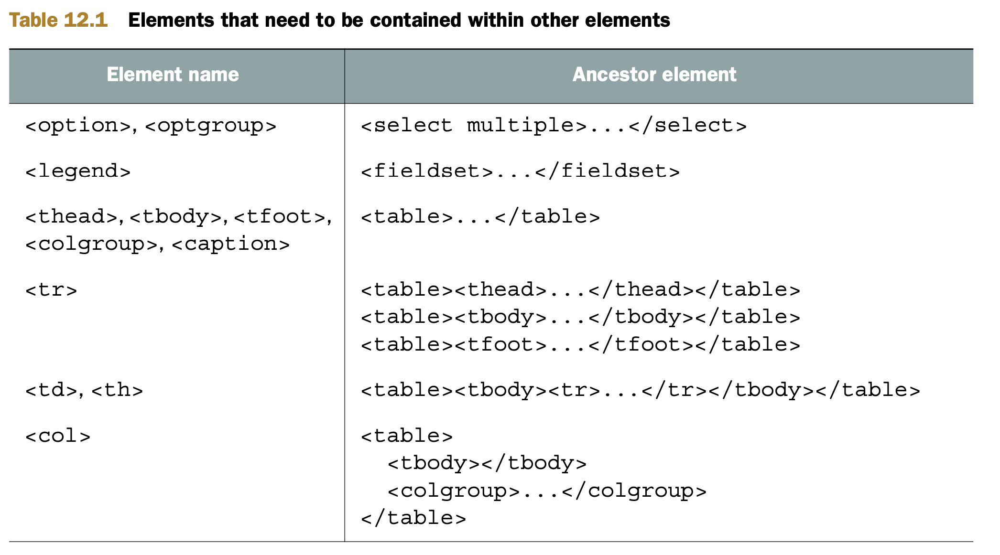

# 12 Working with DOM
This chapter covers
```
■ Inserting HTML into the DOM
■ Understanding DOM attributes and DOM properties
■ Discovering computed styles
■ Dealing with layout thrashing
```
* developing web applications definitely doesn’t get any easier when we throw the browser’s Document Object Model (DOM) into the mix.
* Even presumably simple operations like cloneNode and removeChild have relatively complex implementations.
* This raises two questions -> The most compelling reason is _performance_.
  * Why is this code so complex?
  * Why do you need to understand how it works if the library will take care of it for you?
  
## 12.1 Injecting HTML into the DOM
* It can be technically challenging to implement this functionality correctly 
* Consider this example of 
```
// creating HTML elements from an HTML string that we can use with jQuery
$(document.body).append("<div><h1>Greetings</h1><p>Yoshi here</p></div>")

// And compare that with an approach that uses only the DOM API
const h1 = document.createElement("h1");
h1.textContent = "Greetings";

const p = document.createElement("p");
p.textContent = "Yoshi here";

const div = document.createElement("div");

div.appendChild(h1);
div.appendChild(p);
document.body.appendChild(div);
```
* As the first one looks better, we’ll implement our own way of doing clean DOM manipulation from scratch. The implementation requires the following steps:
  1. Convert an arbitrary but valid HTML string into a DOM structure.
  2. Inject that DOM structure into any location in the DOM as efficiently as possible.


#### 12.1.1 Converting HTML to DOM
* Converting an HTML string to a DOM structure uses a tool that you’re most likely already familiar with: the `innerHTML` property of DOM elements.
  1. Make sure that the HTML string contains valid HTML code.
  2. Wrap the string in any enclosing markup that’s required by browser rules.
  3. Insert the HTML string, using innerHTML, into a dummy DOM element.
  4. Extract the DOM nodes back out.

###### PREPROCESSING THE HTML SOURCE STRING
* To start, we’ll need to clean up the source HTML to meet our needs.
```
<option>Yoshi</option>  // problem #1 should be contained within a select element.
<option>Kuma</option>
<table/>               // problem #2 the self-closing works for only a small subset of elements (table not being one of them).
```
* Let’s start with solving the problem of self-closing elements.
```
// Listing 12.1 Making sure that self-closing elements are interpreted correctly
const tags = /^(area|base|br|col|embed|hr|img|input|keygen|link|menuitem|meta|param|source|track|wbr)$/i;

function convert(html) {
  return html.replace(/(<(\w+)[^>]*?)\/>/g, (all, front, tag) => {
    return tags.test(tag) ? all : front + "></" + tag + ">";
  });
}

assert(convert("<a/>") === "<a></a>", "Check anchor conversion.");
assert(convert("<hr/>") === "<hr/>", "Check hr conversion.");
```

###### HTML WRAPPING
* According to the semantics of HTML, some HTML elements must be within certain container elements before they can be injected. For example, an `<option>` element must be contained within a `<select>`.
* We can solve this problem in two ways, both of which require constructing a mapping between problematic elements and their containers:
  * The string could be injected directly into a specific parent by using `innerHTML`, where the parent has been previously constructed using the built-in document createElement. Although this may work in some cases and in some browsers, it isn’t universally guaranteed.
  * The string could be wrapped with the appropriate required markup and then injected directly into any container element (such as a `<div>`). This is more foolproof, but it’s also more work.
* The second technique is preferred; it involves little browser-specific code, in contrast to the first approach, which requires a fair amount of mostly browser-specific code.
  * The set of problematic elements that need to be wrapped in specific container ele- ments is fortunately a rather manageable seven.
  
  ```
  // Listing 12.2 Generating a list of DOM nodes from some markup
  function getNodes(htmlString, doc) {
    const map = {
      "<td": [3, "<table><tbody><tr>", "</tr></tbody></table>"], // [#{depth}, #{opening html}, #{closing html}]
      "<th": [3, "<table><tbody><tr>", "</tr></tbody></table>"],
      "<tr": [2, "<table><thead>", "</thead></table>"],
      "<option": [1, "<select multiple>", "</select>"],
      "<optgroup": [1, "<select multiple>", "</select>"],
      "<legend": [1, "<fieldset>", "</fieldset>"],
      "<thead": [1, "<table>", "</table>"],
      "<tbody": [1, "<table>", "</table>"],
      "<tfoot": [1, "<table>", "</table>"],
      "<colgroup": [1, "<table>", "</table>"],
      "<caption": [1, "<table>", "</table>"],
      "<col": [2, "<table><tbody></tbody><colgroup>", "</colgroup></table>"],
    };
    const tagName = htmlString.match(/<\w+/);
    let mapEntry = tagName ? map[tagName[0]] : null;
    if (!mapEntry) {
      mapEntry = [0, " ", " "];
    }
    let div = (doc || document).createElement("div");
    div.innerHTML = mapEntry[1] + htmlString + mapEntry[2];
    while (mapEntry[0]--) {
      div = div.lastChild;
    }
    return div.childNodes; // Returns the newly created element
  }

  assert(
    getNodes("<td>test</td><td>test2</td>").length === 2,
    "Get two nodes back from the method."
  );
  assert(
    getNodes("<td>test</td>")[0].nodeName === "TD",
    "Verify that we're getting the right node."
  );
  ```
#### 12.1.2 Inserting elements into the document
* After we have the DOM nodes, it’s time to insert them into the document.
* We can do this by using DOM fragments. DOM fragments are part of the W3C DOM specification and are supported in all browsers.
```
// Listing 12.3 Expanding the getNodes function with fragments
function getNodes(htmlString, doc, fragment) {
  const map = {
    "<td": [3, "<table><tbody><tr>", "</tr></tbody></table>"], // [#{depth}, #{opening html}, #{closing html}]
    "<th": [3, "<table><tbody><tr>", "</tr></tbody></table>"],
    "<tr": [2, "<table><thead>", "</thead></table>"],
    "<option": [1, "<select multiple>", "</select>"],
    "<optgroup": [1, "<select multiple>", "</select>"],
    "<legend": [1, "<fieldset>", "</fieldset>"],
    "<thead": [1, "<table>", "</table>"],
    "<tbody": [1, "<table>", "</table>"],
    "<tfoot": [1, "<table>", "</table>"],
    "<colgroup": [1, "<table>", "</table>"],
    "<caption": [1, "<table>", "</table>"],
    "<col": [
      2,
      "<table><tbody></tbody><colgroup>",
      "</colgroup></table>",
    ],
  };
  const tagName = htmlString.match(/<\w+/);
  let mapEntry = tagName ? map[tagName[0]] : null;
  if (!mapEntry) {
    mapEntry = [0, " ", " "];
  }
  let div = (doc || document).createElement("div");
  div.innerHTML = mapEntry[1] + htmlString + mapEntry[2];
  while (mapEntry[0]--) {
    div = div.lastChild;
  }

  // if the fragment exists, injects the nodes into it.
  if (fragment) {
    while (div.firstChild) {
      fragment.appendChild(div.firstChild); // https://stackoverflow.com/a/12146920
    }
  }
  return div.childNodes;
}
```
* Now, let’s see it in use. This DOM is now appended to the fragment.
```
// Listing 12.4 Inserting a DOM fragment into multiple locations in the DOM
<ul id="content"></ul>
<div id="test"><b>Hello</b>, I'm a ninja!</div>
<script>
  function root(elem, cur) {
    return elem.nodeName.toLowerCase() === "table" && cur.nodeName.toLowerCase() === "tr" ?
        (elem.getElementsByTagName("tbody")[0] || elem.appendChild(elem.ownerDocument.createElement("tbody"))) : elem;
  }
  
  document.addEventListener("DOMContentLoaded", () => {
    function insert(elems, args, callback) {
      if (elems.length) {
        const doc = elems[0].ownerDocument || elems[0],
          fragment = doc.createDocumentFragment(),
          scripts = getNodes(args, doc, fragment),
          first = fragment.firstChild;
          
        if (first) {
          int elemSize = elems
          for (let i = 0; elems[i]; i++) {
            callback.call(
              root(elems[i], first),
              // i > 0 ? fragment.cloneNode(true) : fragment // If we need to insert the nodes into more than one element, we have to clone the fragment each time
              fragment.cloneNode(true) // https://stackoverflow.com/questions/29352976/why-is-documentfragment-cleared-after-appending
            );
          }
        }
      }
    }

    const divs = document.querySelectorAll("div");
    insert(divs, "<b>Name:</b>", function (fragment) {
      this.appendChild(fragment);
    });
    
    insert(divs, "<span>First</span> <span>Last</span>", function (fragment) {
      this.parentNode.insertBefore(fragment, this);
    });
  });
</script>
```

## 12.2 Using DOM attributes and properties
* When accessing the values of element attributes, we have two options: using the tradi- tional DOM methods of `getAttribute` and `setAttribute`, or using properties of the DOM objects that correspond to the attributes.
  ```
  e.getAttribute('id') 
  e.id
  ```
* But don’t let this fool you into thinking that the property and attribute are sharing the same value — they aren’t. We’ll see later in this chapter that the attribute and corresponding property, although linked, aren’t always identical.
* It’s important to note that not all attributes are represented by element properties.
* If you’re not sure whether a property for an attribute exists, you can always test for it and fall back to the DOM methods if it doesn’t exist. Here’s an example:
  ```
  const value = element.someValue ? element.someValue : element.getAttribute('someValue');
  ```
* TIP - In HTML5, use the prefix data- for all custom attributes to keep them valid in the eye of the HTML5 specification. It’s a good convention that clearly separates custom attributes from native attributes.

## 12.3 Styling attribute headaches
* As with the attributes and properties in the previous section, we again have two approaches for handling style values: the attribute value, and the element property created from it.
  * The most commonly used of these is the style element property, which isn’t a string but an object that holds properties corresponding to the style values specified in the element markup.
  * In addition, you’ll see that there’s a method for accessing the computed style information of an element, where `computed style` means the style that will be applied to the element after evaluating all inherited and applied style information.
  
#### 12.3.1 Where are my styles?
* The style information located in the style property of a DOM element is initially set from the value specified for the style attribute in the element markup. 
  * For example, style="color:red;" results in that style information being placed into the style object.
* Many script authors are disappointed to find that no values from on-page `<style>` elements or external style sheets are available in the element’s style object.
  * But we won’t stay disappointed for long — you’ll soon see a way to obtain this information.
```
// Listing 12.6 Examining the style property
<style> // Declares an in-page style sheet that applies font size and border information
  div {
    font-size: 1.8em;
    border: 0 solid gold;
  }
</style>

<div style="color: #3d00ff" title="Ninja power!">忍者パワー</div>
<script>
  document.addEventListener("DOMContentLoaded", () => {
    const div = document.querySelector("div");
    assert(
      div.style.color === "rgb(61, 0, 255)" || div.style.color === "#3d00ff",
      "color was recorded"
    ); // success
    assert(div.style.fontSize === "1.8em", "fontSize was recorded"); // fail
    assert(div.style.borderWidth === "0", "borderWidth was recorded"); // fail
    
    div.style.borderWidth = "4px";
    assert(div.style.borderWidth === "4px", "borderWidth was replaced"); // success
  });
</script>
```
* This is because the `style` object doesn’t reflect any style information inherited from CSS style sheets:

#### 12.3.2 Style property naming
* CSS attributes cause relatively few cross-browser difficulties when it comes to accessing the values provided by the browser. 
  * But differences between how CSS names styles and how we access those in script do exist, and some style names differ across browsers.
* multiword CSS style names are converted to camel case when used as a property name.
  * As a result, `font-size` becomes `fontSize`, and `background-color` becomes `backgroundColor`.

#### 12.3.3 Fetching computed styles
* At any point in time, the computed style of an element is a combination of 
  * all the built-in styles provided by the browser, 
  * all the styles applied to it via style sheets, 
  * the element’s style attribute, 
  * and any manipulations of the style property by script. 
* The standard method, implemented by all modern browsers, is the `getComputedStyle` method. 
  * This method accepts an element whose styles are to be computed 
  * and returns an interface through which property queries can be made. 
  * The returned interface provides a method named `getPropertyValue` for retrieving the computed style of a specific style property.
  ```
  // Listing 12.8 Fetching computed style values
  <style>
    div {
      background-color: #ffc;
      display: inline;
      font-size: 1.8em;
      border: 1px solid crimson; // `amalgam` properties
      color: green;
    }
  </style>

  <ul id="content"></ul>

  <div style="color: crimson" id="testSubject" title="Ninja power!">
    忍者パワー
  </div>
  <script>
    function fetchComputedStyle(element, property) {
      const computedStyles = getComputedStyle(element);
      if (computedStyles) {
        property = property.replace(/([A-Z])/g, "-$1").toLowerCase();
        return computedStyles.getPropertyValue(property);
      }
    }
    document.addEventListener("DOMContentLoaded", () => {
      const div = document.querySelector("div");
      report(
        "background-color: " + fetchComputedStyle(div, "background-color")
      );
      report("display: " + fetchComputedStyle(div, "display"));
      report("font-size: " + fetchComputedStyle(div, "fontSize"));
      report("color: " + fetchComputedStyle(div, "color"));
      report("border-top-color: " + fetchComputedStyle(div, "borderTopColor")); // fetching `amalgam` property
      report("border-top-width: " + fetchComputedStyle(div, "border-top-width")); // fetching `amalgam` property
    });
  </script>
  ```
#### 12.3.4 Converting pixel values
* An important point to consider when setting style values is the assignment of numeric values that represent pixels. 
  * When setting a numeric value for a style property, we must specify the unit in order for it to work reliably across all browsers. 
* Either of the following is a safe way to do this across browsers:
```
element.style.height = "10px"; 
element.style.height = 10 + "px";
```
* The following isn’t safe across browsers:
```
element.style.height = 10;
```
* Some style properties take numeric values that don’t represent a pixel dimension. The list includes the following:
```
■ z-index
■ font-weight 
■ opacity
■ zoom
■ line-height
```
#### 12.3.5 Measuring heights and widths


##
####
####
####
######
######
